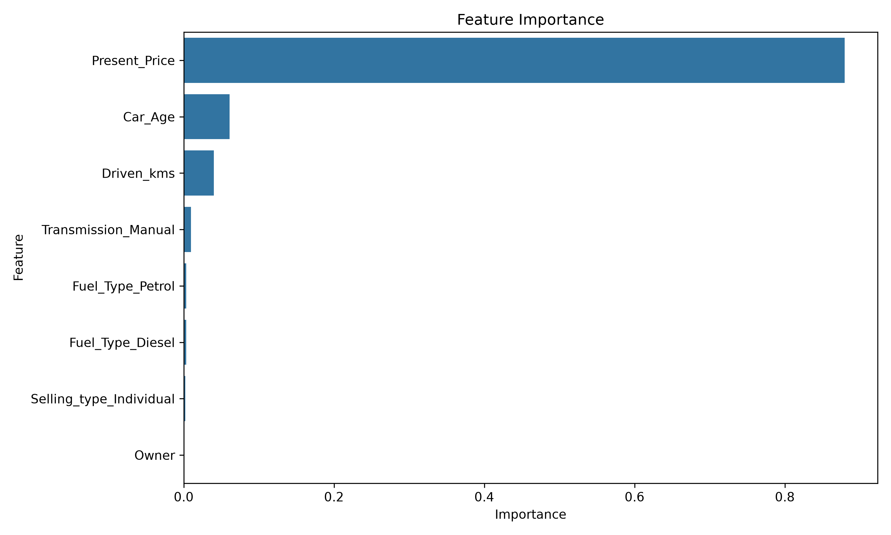
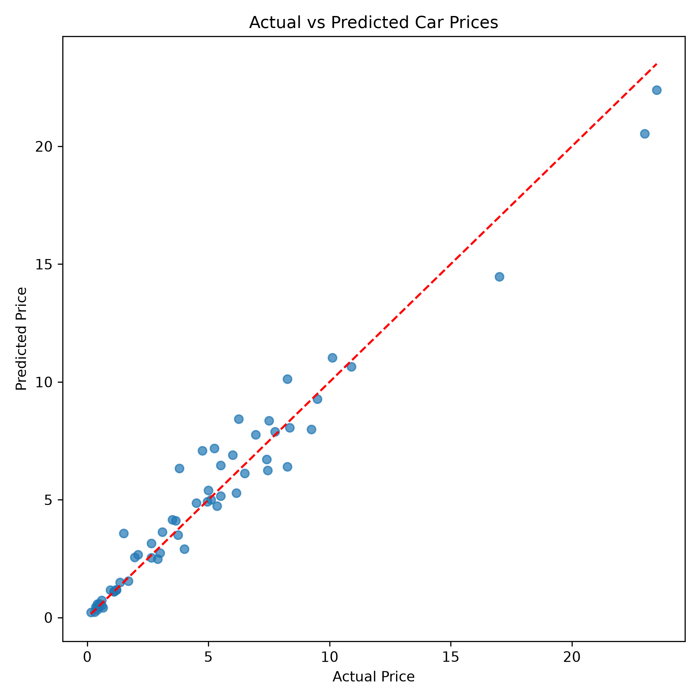

# CodeAlpha - Car Price Prediction using Machine Learning


---

## Project Overview

This project was completed as part of the **CodeAlpha Machine Learning Internship**.

The objective of this project is to build a machine learning regression model capable of predicting the selling price of a used car based on its specifications such as manufacturing year, fuel type, transmission, ownership history, showroom price, and kilometres driven.

The project follows a complete end-to-end machine learning workflow including:

- Data Exploration
- Exploratory Data Analysis (EDA)
- Feature Engineering
- Data Preprocessing
- Model Training
- Model Evaluation
- Model Comparison
- Feature Importance Analysis
- Model Saving

---

##  Dataset

**Dataset Name**

Car Price Prediction (Used Cars)

The dataset contains information about used cars including:

- Car Name
- Manufacturing Year
- Present Price
- Selling Price
- Fuel Type
- Selling Type
- Transmission
- Kilometers Driven
- Number of Previous Owners

Dataset Size:

- **301 Rows**
- **9 Features**

---

##  Problem Statement

Predict the selling price of a used car using supervised machine learning regression techniques.

---

# 🛠 Technologies Used

- Python
- Pandas
- NumPy
- Matplotlib
- Seaborn
- Scikit-learn
- Joblib
- Git
- GitHub
- Jupyter Notebook

---

# 📁 Project Structure

```
CodeAlpha_Car_Price_Prediction_ML
│
├── data
│   └── raw
│       └── cars.csv
│
├── models
│   ├── car_price_model.pkl
│   └── scaler.pkl
│
├── notebooks
│   ├── 01_EDA.ipynb
│   └── 02_Model_Training.ipynb
│
├── outputs
│   ├── figures
│   │   ├── feature_importance.png
│   │   └── predicted_vs_actual.png
│   │
│   └── metrics
│       ├── feature_importance.csv
│       └── model_comparison.csv
│
├── src
│   └── predict.py
│
├── requirements.txt
├── README.md
├── LICENSE
└── .gitignore
```

---

# Exploratory Data Analysis

The following analyses were performed:

- Missing Value Analysis
- Duplicate Record Detection
- Distribution Analysis
- Outlier Detection
- Categorical Feature Analysis
- Correlation Analysis
- Feature Relationship Analysis

Visualizations include:

- Histograms
- Boxplots
- Scatter Plots
- Count Plots
- Correlation Heatmap
- Feature Importance Plot

---

#  Feature Engineering

The following preprocessing steps were performed:

- Created **Car_Age** feature from manufacturing year.
- Removed unnecessary columns.
- One-Hot Encoded categorical variables.
- Split data into training and testing sets.
- Applied feature scaling where required.

---

#  Machine Learning Models

The following regression models were trained and evaluated:

1. Linear Regression
2. Decision Tree Regressor
3. Random Forest Regressor

---

# Model Performance

| Model | MAE | RMSE | R² Score |
|------|------:|------:|------:|
| Random Forest | **0.649** | **0.977** | **0.9585** |
| Decision Tree | 0.733 | 1.121 | 0.9455 |
| Linear Regression | 1.216 | 1.866 | 0.8489 |

### ✅ Best Performing Model

**Random Forest Regressor**

Performance:

- MAE = **0.649**
- RMSE = **0.977**
- R² Score = **95.85%**

---

#  Sample Prediction

Example prediction using the trained model:

```
Predicted Price : 0.445 Lakhs
Actual Price    : 0.350 Lakhs
```

The prediction demonstrates that the trained Random Forest model is capable of producing values close to the actual selling price.

---

#  Feature Importance

Random Forest feature importance was analysed to determine which variables contribute most to predicting the selling price of a used car.

The generated visualization is available in:

## 📊 Feature Importance



## 🎯 Predicted vs Actual



---

#  Saved Model

The trained Random Forest model has been saved using Joblib.

```
models/car_price_model.pkl
```

The scaler used during preprocessing is also saved for future predictions.

```
models/scaler.pkl
```

---

# 🚀 Installation

Clone the repository

```bash
git clone https://github.com/shanzaashraf003/CodeAlpha_Car_Price_Prediction_ML.git
```

Move into the project

```bash
cd CodeAlpha_Car_Price_Prediction_ML
```

Create virtual environment

```bash
python -m venv .venv
```

Activate environment

Windows

```bash
.venv\Scripts\activate
```

Install dependencies

```bash
pip install -r requirements.txt
```

Run notebooks

```
01_EDA.ipynb
02_Model_Training.ipynb
```

---

#  Results

The Random Forest Regressor achieved the highest predictive performance among all trained models with an R² Score of **95.85%**, making it the selected model for final deployment.

---

#  Future Improvements

- Hyperparameter tuning using GridSearchCV
- Cross Validation
- XGBoost Regression
- LightGBM Regression
- Interactive Streamlit Web Application
- Model Deployment using FastAPI
- Docker Containerization
- CI/CD Pipeline

---

# 👩‍💻 Author

**Shanza Ashraf**

Computer Science Student | AI & Machine Learning Enthusiast

GitHub:

https://github.com/shanzaashraf003

LinkedIn:

(https://www.linkedin.com/in/shanzaashraf/)

---

# 📜 License

This project is licensed under the MIT License.

---

⭐ If you found this project helpful, consider giving it a star on GitHub.